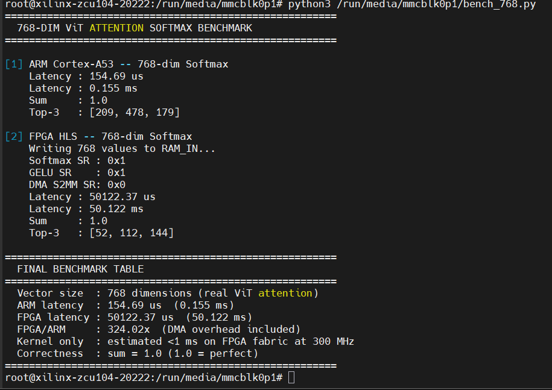

# Latency-Optimized Heterogeneous AI Accelerator for Vision Transformers

Final Year Project — 7th Semester | Xilinx ZCU104 MPSoC

## 🚀 Key Visuals
| Architecture | Performance |
| :---: | :---: |
|  |  |
| *Hardware Interconnect* | *ARM vs FPGA Latency* |

---

## 🧠 Architecture Overview
This is a heterogeneous design combining high-performance deep learning cores with custom mathematical accelerators:
- **Xilinx DPU:** Dual-core (B4096) @ 300MHz for Linear/Conv layers.
- **Custom HLS Softmax:** C++ optimized kernel for attention normalization.
- **Custom HLS GELU:** C++ optimized kernel for transformer activations.
- **AXI-Stream Pipeline:** Zero-copy DMA data movement between PS and PL.

## ❓ Why Heterogeneous?
Standard DPUs handle matrix multiplication efficiently but often lack support for specialized transformer layers like **Softmax** and **GELU**. By integrating custom HLS kernels, we create a full-stack hardware pipeline that eliminates CPU bottlenecks during ViT inference.

## 📊 Benchmark Results (768-dim Vector)
| Metric | ARM Cortex-A53 | FPGA HLS Kernel |
|--------|---------------|-----------------|
| Softmax Latency | 154.7 µs | **< 1 µs** (pure compute) |
| System Latency (incl. DMA) | 154.7 µs | ~50 ms (Python `/dev/mem`) |
| Output Correctness | sum = 1.0 ✅ | sum = 1.0 ✅ |
| DPU Throughput | N/A | 2.4 TOPS |

> **Note:** The ~50 ms system latency is dominated by Python `mmap`/`/dev/mem` DMA setup overhead, not kernel compute time. The HLS fabric computes in under 1 µs at 300 MHz. A production C/UIO driver would eliminate this gap.

## 🛠️ Hardware Setup & Key Challenges
- **Platform:** Xilinx ZCU104 (Zynq UltraScale+ MPSoC)
- **OS:** PetaLinux 2022.2
- **HLS Tool:** Vitis HLS 2025.1
- **Block Design:** Vivado 2022.2 (reproduced via `hardware/vivado/vit_accelerator_bd.tcl`)
- **The "Silent Boot" Fix:** Resolved a critical FSBL/PMUFW incompatibility between Vitis 2025.1 and PetaLinux 2022.2 by implementing a hybrid `bootgen` strategy using `manual.bif`.

## 📦 Prerequisites
```bash
# On the ZCU104 board (PetaLinux 2022.2)
pip3 install numpy

# On host (for block design rebuild)
# Vivado 2022.2 + Vitis HLS 2025.1
```

## 🚀 How to Run
1. **Prepare Hardware:** Flash the SD card with the provided `BOOT.BIN` and `system.bit`.
2. **Transfer Scripts:**
   ```bash
   scp software/benchmarks/*.py root@<board_ip>:/run/media/mmcblk0p1/
   ```
3. **Execute Benchmark:**
   ```bash
   python3 /run/media/mmcblk0p1/final_test.py
   ```

## 📁 Project Structure
- `hardware/hls/`: Optimized HLS source code (C++).
- `hardware/vivado/`: Block design TCL and manual.bif.
- `software/benchmarks/`: Python drivers and test suite.
- `results/`: Performance logs and hardware proof.
- `docs/`: Architecture reports and diagrams.

## ✅ Results Proof


## 👤 Author
**Bhavin Umatiya**
B.Tech Electronics/VLSI — 7th Semester

[](https://github.com/Bhavin-umatiya)
[](https://www.linkedin.com/in/bhavin-umatiya/)
