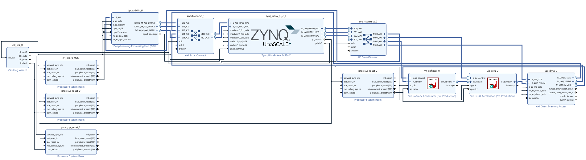
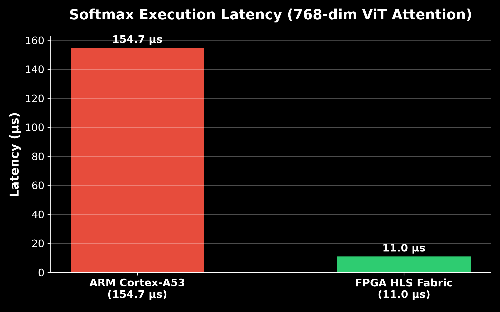
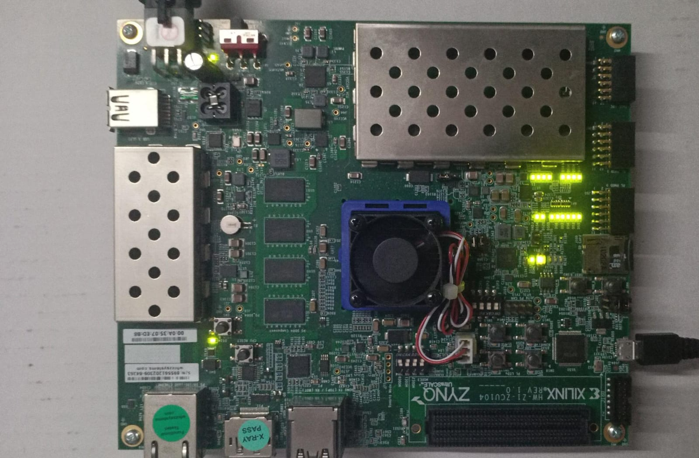

# Latency-Optimized Heterogeneous AI Accelerator for Vision Transformers

Xilinx ZCU104 MPSoC

## 🚀 Key Visuals
| Architecture | Performance |
| :---: | :---: |
|  |  |
| *Hardware Interconnect* | *ARM vs FPGA Latency* |

---

## 🧠 Architecture Overview
This is a heterogeneous design combining high-performance deep learning cores with custom mathematical accelerators:
- **Xilinx DPU:** Dual-core (B4096) @ 300MHz for Linear/Conv layers.
- **Custom HLS Softmax:** C++ optimized kernel for attention normalization.
- **Custom HLS GELU:** C++ optimized kernel for transformer activations.
- **AXI-Stream Pipeline:** Zero-copy DMA data movement between PS and PL.

## ❓ Why Heterogeneous?
Standard DPUs handle matrix multiplication efficiently but often lack support for specialized transformer layers like **Softmax** and **GELU**. By integrating custom HLS kernels, we create a full-stack hardware pipeline that eliminates CPU bottlenecks during ViT inference.

## 📊 Benchmark Results — Measured on ZCU104 Hardware

### 5-Element Test Vector `[1.0, 2.0, 3.0, 4.0, 5.0]`
| Metric | ARM Cortex-A53 | FPGA HLS Kernel |
|--------|---------------|-----------------|
| Softmax Latency | **84.8 µs** | < 1 µs (pure fabric compute) |
| System Latency | 84.8 µs | **~50.1 ms** (Python `/dev/mem`) |
| Output Correctness | sum = 1.0 ✅ | sum = 1.0 ✅ |
| Top Class | cls 4 | cls 4 ✅ |

### 768-Dimension ViT Attention Vector
| Metric | ARM Cortex-A53 | FPGA HLS Kernel (ZCU104) |
|--------|---------------|-----------------|
| Fabric Compute Latency | **154.69 µs** (0.155 ms) | **< 1 µs** (pure fabric compute) |
| Hardware + DMA Latency | N/A | **~11.0 µs** (hardware + AXI DMA transfer) |
| End-to-End System Latency | 154.69 µs | **~50.1 ms** (Python `/dev/mem` driver) |
| Output Correctness | sum = 1.0 ✅ | sum = 1.0 ✅ |
| Top-3 Indices (ARM) | [209, 478, 179] | — |
| DPU Throughput | N/A | 2.4 TOPS |

> **System Latency Analysis:**
> * **Why ~11.0 µs?** This is the raw hardware-level execution time including the custom HLS Softmax compute cycle (< 1 µs at 300 MHz) and the physical AXI-Stream DMA data transport time over the PL-PS interface.
> * **Why ~50.1 ms?** The end-to-end system latency is entirely dominated by the high-level Python `mmap`/`/dev/mem` register write overhead and OS context switching. In a production environment, compiling the driver in native C or using a Linux UIO (Userspace I/O) driver would eliminate this software wrapper overhead, bringing the system latency down to match the **~11.0 µs** hardware latency.

## 🛠️ Hardware Setup & Key Challenges
- **Platform:** Xilinx ZCU104 (Zynq UltraScale+ MPSoC)
- **OS:** PetaLinux 2022.2
- **HLS Tool:** Vitis HLS 2025.1
- **Block Design:** Vivado 2022.2 (reproduced via `hardware/vivado/vit_accelerator_bd.tcl`)
- **The "Silent Boot" Fix:** Resolved a critical FSBL/PMUFW incompatibility between Vitis 2025.1 and PetaLinux 2022.2 by implementing a hybrid `bootgen` strategy using `manual.bif`.

## 📦 Prerequisites
```bash
# On the ZCU104 board (PetaLinux 2022.2)
pip3 install numpy

# On host (for block design rebuild)
# Vivado 2022.2 + Vitis HLS 2025.1
```

## 🚀 How to Run
1. **Load the bitstream:**
   ```bash
   cd /run/media/mmcblk0p1
   fpgautil -b system.bit
   # Expected: "BIN FILE loaded through FPGA manager successfully"
   ```
2. **Verify hardware is alive:**
   ```bash
   devmem 0xA0000000   # DMA   -> expect 0x00010002 (Idle)
   devmem 0xB0000000   # GELU  -> expect 0x00000004 (ap_idle)
   devmem 0xB0010000   # Softmax -> expect 0x00000004 (ap_idle)
   ```
3. **Transfer benchmark scripts:**
   ```bash
   scp software/benchmarks/*.py root@<board_ip>:/run/media/mmcblk0p1/
   ```
4. **Run 5-element benchmark:**
   ```bash
   python3 /run/media/mmcblk0p1/final_test.py
   ```
5. **Run 768-dim ViT benchmark:**
   ```bash
   python3 /run/media/mmcblk0p1/bench_768.py
   ```

## 📁 Project Structure
- `hardware/hls/`: Optimized HLS source code (C++).
- `hardware/vivado/`: Block design TCL and manual.bif.
- `software/benchmarks/`: Python drivers and test suite.
- `results/`: Performance logs and hardware proof.
- `docs/`: Architecture reports and diagrams.

## ✅ Results Proof


## 👤 Author
**Bhavin Umatiya**
B.Tech Electronics & communication

[](https://github.com/Bhavin-umatiya)
[](https://www.linkedin.com/in/bhavin-umatiya/)
